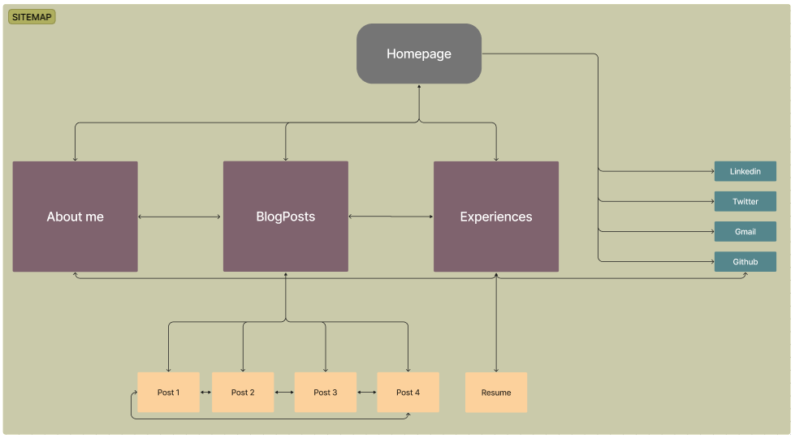

# Michelle Liang T1A2

## Links to content

[Github](https://github.com/mcelle888/MichelleLiang_T1A2)\
[Website](https://michelle-liang-t1-a2-irgc0h48a-mcelle888s-projects.vercel.app/index.html)\
[Presentation](#present)

## Purpose and Target Audience
The pupose of this portfolio website is to create a platform that is easily accessible for potential employers to get to know me. The target audience includes potential employers in the IT field looking for junior hires. It allows them to examine my background details, education and experiences in a more creative manner whilst also demonstrating my abilitity to generate a fully functional website.

## Fuctionality and Features

The website includes four main pages ("Home", "About", "Work" and "Blog Post") with 4 additional blog pages. All pages include a navigation bar on top which allows the user to easily navigate back to the main pages. The navigation bar's font size scales with the width of the screen to ensure easy readability across devices. Icons in the title's tabs have also been added to each page to allow the user to differentiate each page. Each page has a responsive layout to ensure easy access across multiple devices. The purpose and different features exclusive to each page are described below.

#### Home Page
The home page features a quick introduction to myself and the website. It also includes links to my contact details and social media accounts in the form of icons. 

#### About Me
This page extends on my personal background and hobbies. It features two textboxes detailing information more personal to myself and four images to visually engage the audience. 

#### Work 
This content on this page is divided into three sections: "*Education*" (detailing my schooling years), "*Work*" (describing my most recent work history) and "*Projects*" (presenting my past, current and future IT projects). Links to my Github and Resume (note a mockup resume has been used at the moment) are available on the page. 

#### Blogpost
The blogs are centered around one of my hobbies: cakes! It links to four individual recipes with the link text highlighted in different colours when hovered. 

#### Individual blogs (4) 
Each blogpost contains a more detailed description of each recipe. The texts both use list formats for readability. A larger photo is used to highlight the cake as the main attraction of the page. 

## Sitemap

## Wireframes

## Screenshots

## Tech Stack

 * HTML
 * CSS 
 * Deployment: [Vercel](https://vercel.com/)

